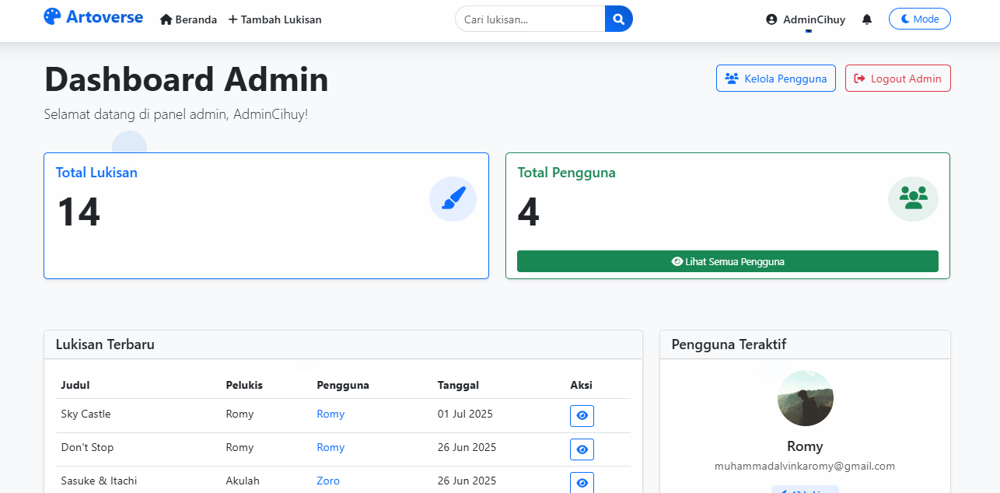
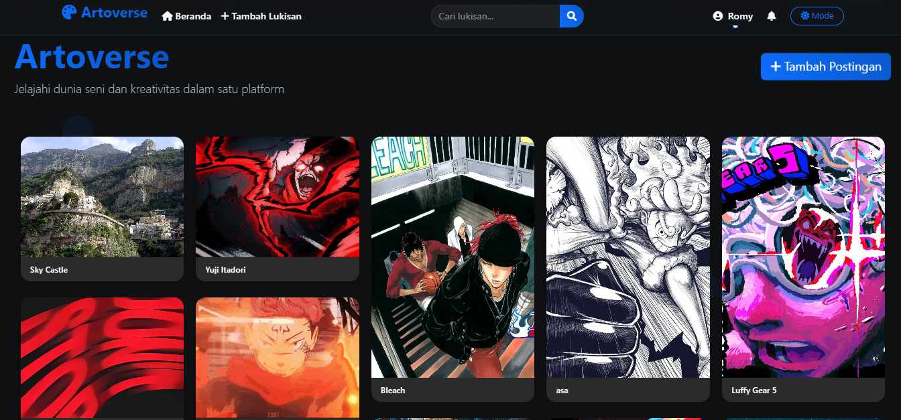
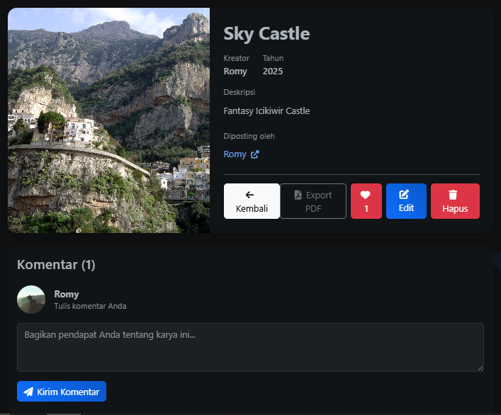

# LAPORAN PROYEK LARAVEL - ROMYVERSE

## I. Link Repositori Proyek Laravel (40 poin)

### 1. Link GitHub Repositori

Link GitHub repositori proyek Laravel Romyverse: [https://github.com/Romyyzhh/romyverse](https://github.com/Romyyzhh/romyverse)

Status repositori: **Public**

File README.md telah disertakan dengan informasi berikut:
- **Nama proyek**: Romyverse (Artoverse)
- **Fitur utama**:
  - Manajemen Karya Seni (Upload, Edit, Galeri Pinterest-Style)
  - Interaksi Sosial (Like, Komentar, Follow, Profil Publik, Notifikasi)
  - Navigasi & Pencarian
  - Manajemen Pengguna (Autentikasi, Panel Admin, Pengelolaan Profil)
- **Instruksi instalasi**: Tersedia lengkap di README.md termasuk prasyarat, langkah instalasi, dan konfigurasi database

### 2. Screenshot Hasil Tampilan Aplikasi

#### Tampilan Halaman Login/Register



#### Tampilan Halaman Data CRUD




#### Dashboard atau Beranda Setelah Login


## II. Fitur Minimal Wajib dalam Proyek (40 poin)

### 1. Fasilitas Login dan Register (10 poin)

#### Menggunakan Middleware Auth
Aplikasi Romyverse mengimplementasikan middleware auth untuk melindungi halaman-halaman tertentu. Middleware ini diterapkan pada:

- **Routes/web.php**:
```php
Route::middleware(['auth'])->group(function () {
    Route::resource('paintings', PaintingController::class)->except(['index', 'show']);
    Route::post('/paintings/{painting}/like', [PaintingController::class, 'like'])->name('paintings.like');
    Route::post('/paintings/{painting}/unlike', [PaintingController::class, 'unlike'])->name('paintings.unlike');
    Route::post('/paintings/{painting}/comments', [CommentController::class, 'store'])->name('comments.store');
    Route::delete('/comments/{comment}', [CommentController::class, 'destroy'])->name('comments.destroy');
    Route::get('/profile', [ProfileController::class, 'edit'])->name('profile.edit');
    Route::put('/profile', [ProfileController::class, 'update'])->name('profile.update');
    Route::post('/follow/{user}', [FollowController::class, 'follow'])->name('follow');
    Route::post('/unfollow/{user}', [FollowController::class, 'unfollow'])->name('unfollow');
});
```

- **Middleware Admin**:
```php
public function handle(Request $request, Closure $next)
{
    if (!auth()->check() || !auth()->user()->is_admin) {
        abort(403, 'Unauthorized action.');
    }
    return $next($request);
}
```

#### Memisahkan Tampilan Pengguna yang Sudah Login dan Belum Login

Aplikasi memiliki tampilan yang berbeda untuk pengguna yang sudah login dan belum login:

- **Navbar untuk pengguna yang belum login**:
  - Menampilkan tombol Login dan Register
  - Tidak menampilkan menu untuk fitur yang memerlukan autentikasi

- **Navbar untuk pengguna yang sudah login**:
  - Menampilkan nama pengguna dan foto profil
  - Menampilkan menu dropdown dengan opsi profil dan logout
  - Menampilkan tombol untuk upload karya baru
  - Jika pengguna adalah admin, menampilkan link ke dashboard admin

Implementasi pada layout.blade.php:
```php
@if (Auth::check())
    <div class="dropdown">
        <a class="nav-link dropdown-toggle" href="#" role="button" data-bs-toggle="dropdown">
            user()->profile_picture ? asset('storage/' . auth()->user()->profile_picture) : asset('images/default-profile.jpg') }}" 
                 class="rounded-circle me-2" width="30" height="30">
            {{ Auth::user()->name }}
        </a>
        <ul class="dropdown-menu">
            <li><a class="dropdown-item" href="{{ route('profile.edit') }}">Profil</a></li>
            @if (Auth::user()->is_admin)
                <li><a class="dropdown-item" href="{{ route('admin.dashboard') }}">Admin Dashboard</a></li>
            @endif
            <li>
                <form method="POST" action="{{ route('logout') }}">
                    @csrf
                    <button type="submit" class="dropdown-item">Logout</button>
                </form>
            </li>
        </ul>
    </div>
@else
    <a href="{{ route('login') }}" class="btn btn-outline-light me-2">Login</a>
    <a href="{{ route('register') }}" class="btn btn-light">Register</a>
@endif
```

### 2. Operasi CRUD (Create, Read, Update, Delete) untuk Entitas Utama (30 poin)

Aplikasi Romyverse mengimplementasikan operasi CRUD untuk entitas utama **Paintings** (Lukisan).

#### CRUD Menggunakan Controller dan Resource Route

- **Resource Route di web.php**:
```php
Route::resource('paintings', PaintingController::class);
```

- **PaintingController.php**:
```php
class PaintingController extends Controller
{
    public function index()
    {
        $paintings = Painting::with('user')->latest()->get();
        return view('paintings.index', compact('paintings'));
    }

    public function create()
    {
        return view('paintings.create');
    }

    public function store(Request $request)
    {
        $request->validate([
            'title' => 'required|max:255',
            'description' => 'required',
            'image' => 'required|image|mimes:jpeg,png,jpg,gif|max:2048',
        ]);

        $imagePath = $request->file('image')->store('paintings', 'public');
        
        Painting::create([
            'title' => $request->title,
            'description' => $request->description,
            'artist' => auth()->user()->name,
            'year' => date('Y'),
            'image' => $imagePath,
            'user_id' => auth()->id()
        ]);

        return redirect()->route('paintings.index')->with('success', 'Lukisan berhasil ditambahkan!');
    }

    public function show(Painting $painting)
    {
        $painting->load(['comments.user', 'user']);
        return view('paintings.show', compact('painting'));
    }

    public function edit(Painting $painting)
    {
        $this->authorize('update', $painting);
        return view('paintings.edit', compact('painting'));
    }

    public function update(Request $request, Painting $painting)
    {
        $this->authorize('update', $painting);
        
        $request->validate([
            'title' => 'required|max:255',
            'description' => 'required',
            'image' => 'nullable|image|mimes:jpeg,png,jpg,gif|max:2048',
        ]);

        $data = [
            'title' => $request->title,
            'description' => $request->description,
        ];

        if ($request->hasFile('image')) {
            // Hapus gambar lama jika ada
            if ($painting->image && Storage::disk('public')->exists($painting->image)) {
                Storage::disk('public')->delete($painting->image);
            }
            
            $imagePath = $request->file('image')->store('paintings', 'public');
            $data['image'] = $imagePath;
        }

        $painting->update($data);

        return redirect()->route('paintings.show', $painting)->with('success', 'Lukisan berhasil diperbarui!');
    }

    public function destroy(Painting $painting)
    {
        $this->authorize('delete', $painting);
        
        // Hapus gambar dari storage
        if ($painting->image && Storage::disk('public')->exists($painting->image)) {
            Storage::disk('public')->delete($painting->image);
        }
        
        $painting->delete();

        return redirect()->route('paintings.index')->with('success', 'Lukisan berhasil dihapus!');
    }
}
```

#### Validasi Form di Sisi Server (Backend)

Validasi form diterapkan pada method `store` dan `update` di PaintingController:

- **Validasi pada method store**:
```php
$request->validate([
    'title' => 'required|max:255',
    'description' => 'required',
    'image' => 'required|image|mimes:jpeg,png,jpg,gif|max:2048',
]);
```

- **Validasi pada method update**:
```php
$request->validate([
    'title' => 'required|max:255',
    'description' => 'required',
    'image' => 'nullable|image|mimes:jpeg,png,jpg,gif|max:2048',
]);
```

Pesan error validasi ditampilkan pada form dengan kode berikut:

```php
@if ($errors->any())
    <div class="alert alert-danger">
        <ul>
            @foreach ($errors->all() as $error)
                <li>{{ $error }}</li>
            @endforeach
        </ul>
    </div>
@endif
```

## III. Dokumentasi dan Uji Jalan Aplikasi (20 poin)

### 1. Penjelasan Ringkas

#### Struktur Folder Proyek

Proyek Romyverse mengikuti struktur folder standar Laravel dengan beberapa penyesuaian:

- **app/**
  - **Http/**
    - **Controllers/** - Berisi semua controller aplikasi (AuthController, PaintingController, CommentController, dll)
    - **Middleware/** - Berisi middleware kustom seperti AdminMiddleware
    - **Requests/** - Berisi form request validation
  - **Models/** - Berisi model-model aplikasi (User, Painting, Comment, Like, Follow)
  - **Policies/** - Berisi policy untuk otorisasi

- **database/**
  - **migrations/** - Berisi file migrasi untuk struktur database
  - **seeders/** - Berisi seeder untuk data awal aplikasi

- **public/**
  - **images/** - Berisi gambar statis seperti logo
  - **screenshots/** - Berisi screenshot aplikasi untuk dokumentasi

- **resources/**
  - **views/**
    - **admin/** - Berisi view untuk panel admin
    - **auth/** - Berisi view untuk autentikasi
    - **paintings/** - Berisi view untuk CRUD lukisan
    - **profile/** - Berisi view untuk manajemen profil

- **routes/**
  - **web.php** - Berisi definisi route web aplikasi

- **storage/**
  - **app/public/** - Berisi file yang diupload pengguna (gambar lukisan, foto profil)

#### Alur Login hingga ke Dashboard

1. **Proses Login**:
   - Pengguna mengakses halaman login melalui URL `/login`
   - Pengguna memasukkan email dan password
   - Sistem memvalidasi kredensial pengguna
   - Jika valid, pengguna diarahkan ke halaman beranda (/)
   - Jika pengguna adalah admin, mereka dapat mengakses dashboard admin melalui menu dropdown

2. **Proses Register**:
   - Pengguna mengakses halaman register melalui URL `/register`
   - Pengguna mengisi form registrasi (nama, email, password)
   - Sistem memvalidasi input dan membuat akun baru
   - Pengguna diarahkan ke halaman beranda sebagai pengguna yang sudah login

#### Alur CRUD: Bagaimana User Dapat Menambahkan, Mengedit, dan Menghapus Data

1. **Create (Menambahkan Data)**:
   - Pengguna yang sudah login mengklik tombol "Upload Karya" di navbar
   - Sistem menampilkan form tambah lukisan
   - Pengguna mengisi judul, deskripsi, dan mengunggah gambar
   - Pengguna mengklik tombol "Simpan"
   - Sistem memvalidasi input dan menyimpan data
   - Pengguna diarahkan ke halaman beranda dengan pesan sukses

2. **Read (Membaca Data)**:
   - Semua pengguna dapat melihat daftar lukisan di halaman beranda
   - Pengguna dapat mengklik lukisan untuk melihat detail
   - Sistem menampilkan halaman detail lukisan dengan informasi lengkap

3. **Update (Mengedit Data)**:
   - Pemilik lukisan dapat mengklik tombol "Edit" di halaman detail lukisan
   - Sistem menampilkan form edit dengan data yang sudah ada
   - Pengguna mengubah data yang diinginkan
   - Pengguna mengklik tombol "Update"
   - Sistem memvalidasi input dan memperbarui data
   - Pengguna diarahkan kembali ke halaman detail dengan pesan sukses

4. **Delete (Menghapus Data)**:
   - Pemilik lukisan dapat mengklik tombol "Hapus" di halaman detail lukisan
   - Sistem menampilkan konfirmasi penghapusan
   - Jika pengguna mengkonfirmasi, data dihapus
   - Pengguna diarahkan ke halaman beranda dengan pesan sukses

### 2. Screenshot Aplikasi Berjalan

#### Form Login dan Dashboard


#### Form Tambah/Edit Data


#### Tabel Data


## Kesimpulan

Proyek Laravel Romyverse telah berhasil mengimplementasikan semua fitur minimal yang dipersyaratkan, yaitu sistem autentikasi (login dan register) dan operasi CRUD untuk entitas lukisan. Selain itu, proyek ini juga mengimplementasikan fitur tambahan seperti sistem like, komentar, follow, dan panel admin untuk meningkatkan fungsionalitas dan pengalaman pengguna.

Struktur proyek mengikuti standar Laravel dengan organisasi file yang rapi dan terstruktur. Validasi form diterapkan dengan baik di sisi server untuk memastikan integritas data. Alur pengguna dari login hingga melakukan operasi CRUD juga dirancang dengan intuitif dan user-friendly.

Dengan desain antarmuka yang menarik menggunakan layout Pinterest-style, Romyverse menawarkan platform yang menarik bagi seniman untuk memamerkan karya mereka dan bagi penggemar seni untuk menjelajahi dan berinteraksi dengan karya-karya tersebut. 