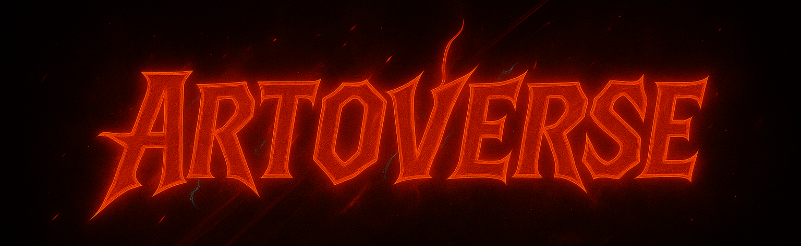
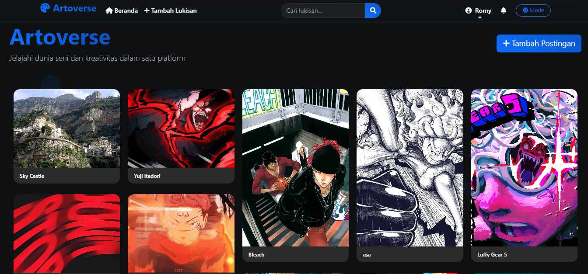
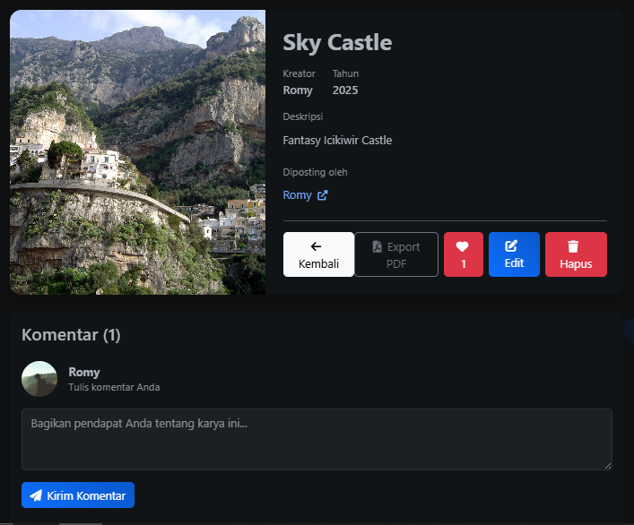
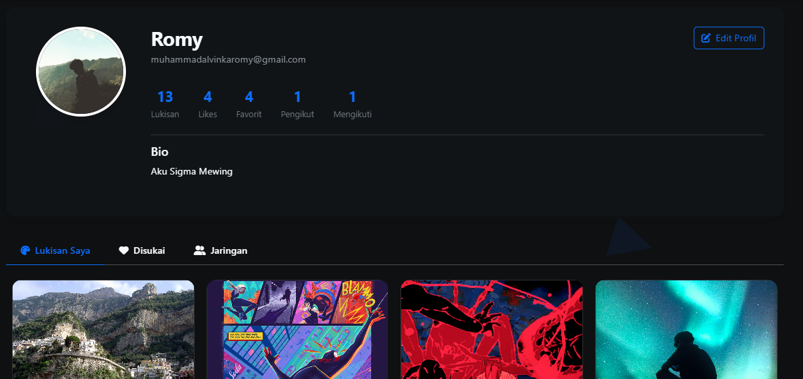
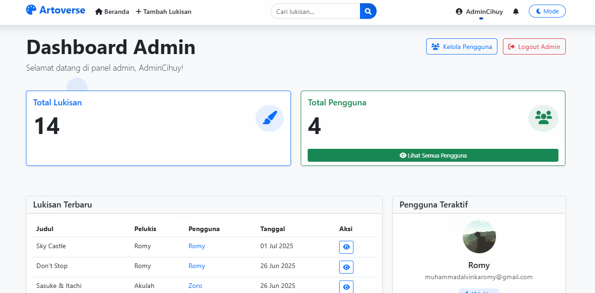

# Romyverse (Artoverse)



Romyverse adalah platform berbagi dan eksplorasi karya seni digital berbasis web. Platform ini memungkinkan seniman untuk memamerkan karya mereka dan penggemar seni dapat menemukan, menyukai, dan berinteraksi dengan lukisan-lukisan menarik dalam pengalaman visual yang menarik dengan layout Pinterest-style.

## ✨ Fitur Utama

### 1. Manajemen Karya Seni
- **Upload & Edit Karya**: Kemudahan dalam mengunggah dan mengelola karya seni dengan deskripsi
- **Galeri Lukisan Pinterest-Style**: Tampilan galeri yang menarik dengan layout dinamis
- **Detail Karya**: Halaman detail untuk setiap karya dengan informasi lengkap

### 2. Interaksi Sosial
- **Sistem Like/Favorit**: Menyimpan dan menandai karya favorit
- **Sistem Komentar**: Diskusi dan feedback untuk setiap karya seni
- **Sistem Follow**: Mengikuti seniman favorit dan melihat update karya terbaru mereka
- **Profil Publik**: Halaman profil untuk melihat semua karya seniman
- **Sistem Notifikasi**: Pemberitahuan saat karya mendapat like atau komentar

### 3. Fitur Navigasi & Pencarian
- **Pencarian**: Mencari lukisan berdasarkan judul, seniman, atau tahun
- **Filter & Kategori**: Pengelompokan karya berdasarkan kategori

### 4. Manajemen Pengguna
- **Autentikasi User & Admin**: Sistem login dan registrasi yang aman
- **Panel Admin**: Manajemen pengguna dan konten
- **Pengelolaan Profil**: Update informasi profil dan foto profil

## 🛠️ Teknologi

- **Backend**: Laravel 12.x
- **Frontend**: HTML, CSS, JavaScript, Bootstrap 5
- **Database**: MySQL
- **Libraries**:
  - Swiper (carousel)
  - Font Awesome (ikon)
  - AOS Animation (animasi scroll)
  - ImagesLoaded (manajemen loading gambar)

## 🚀 Instalasi

### Prasyarat
- PHP 8.1+ dan Composer
- MySQL 5.7+
- Node.js dan NPM (opsional untuk assets)

### Langkah Instalasi

1. **Clone repository**:
   ```
   git clone https://github.com/Romyyzhh/romyverse.git
   cd romyverse
   ```

2. **Install dependencies**:
   ```
   composer install
   ```

3. **Setup environment**:
   ```
   cp .env.example .env
   php artisan key:generate
   ```

4. **Konfigurasi database**:
   - Buat database MySQL
   - Update konfigurasi database di file .env:
   ```
   DB_CONNECTION=mysql
   DB_HOST=127.0.0.1
   DB_PORT=3306
   DB_DATABASE=romyverse
   DB_USERNAME=root
   DB_PASSWORD=
   ```

5. **Jalankan migrasi dan seeder**:
   ```
   php artisan migrate
   php artisan db:seed
   ```

6. **Buat symlink untuk storage**:
   ```
   php artisan storage:link
   ```

7. **Jalankan aplikasi**:
   ```
   php artisan serve
   ```

8. **Akses aplikasi** di browser: [http://localhost:8000](http://localhost:8000)

## 👤 Akun Demo

### Admin
- Email: admin@example.com
- Password: password

### User
- Email: user@example.com
- Password: password

## 📸 Screenshot

### Halaman Beranda


### Halaman Detail Karya


### Halaman Profil


### Panel Admin


## 🌟 Fitur Mendatang

Berikut adalah rencana pengembangan fitur Romyverse di masa mendatang:

- **Kategori/Tag lukisan** - Implementasi sistem kategori atau tag untuk memudahkan navigasi
- **Section trending/populer** - Menampilkan lukisan dengan interaksi tertinggi
- **Filter dan pengurutan** - Opsi filter berdasarkan tanggal, popularitas, artis
- **Integrasi media sosial** - Pembagian karya ke platform sosial media
- **Sistem pesan langsung** - Komunikasi antar pengguna melalui sistem pesan pribadi

## 🤝 Kontribusi

Kontribusi selalu disambut! Jika Anda ingin berkontribusi:

1. Fork repository
2. Buat branch fitur (`git checkout -b feature/amazing-feature`)
3. Commit perubahan (`git commit -m 'Add some amazing feature'`)
4. Push ke branch (`git push origin feature/amazing-feature`)
5. Buka Pull Request

## 📄 Lisensi

Romyverse dilisensikan di bawah [MIT License](https://opensource.org/licenses/MIT).

## 👨‍💻 Pengembang

- **Romyverse Team** - [GitHub](https://github.com/Romyyzhh)

---

&copy; 2023-2025 Romyverse. All Rights Reserved.
